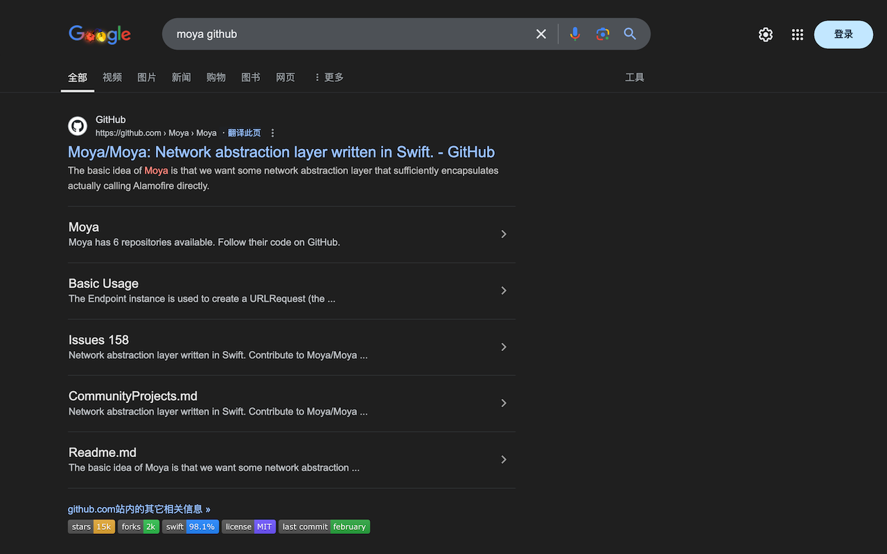

# GitHub Repo Radar 

[](https://chrome.google.com/webstore/detail/ahagjhfplmcmjcokpcicegacliahfckb)
[](https://chrome.google.com/webstore/detail/ahagjhfplmcmjcokpcicegacliahfckb)
[](https://github.com/ygsgdbd/github-repo-radar/blob/main/LICENSE)
[](https://github.com/ygsgdbd/github-repo-radar/pulls)

A Chrome extension that enhances your GitHub repository search experience by displaying repository information directly in search results.



## Tech Stack

- ⚛️ **React** - UI development
- 🎨 **Tailwind CSS** - Styling
- 🧩 **Plasmo** - Extension framework
- 📦 **TypeScript** - Type safety
- 🔧 **Chrome Extension Manifest V3** - Extension architecture

## Features

- 🔍 Shows repository information in Google search results
- ⭐️ Displays stars and forks count
- 📝 Shows primary programming language
- ⚖️ Displays repository license
- 🕒 Shows last update time
- 🌓 Supports dark mode
- 🔒 Privacy focused - no data collection

## Roadmap

- 🔄 Support for more search engines:
  - Bing
  - DuckDuckGo
  - Baidu
  - More to come...

## Installation

### Chrome Web Store
1. Visit [GitHub Repo Radar](https://chrome.google.com/webstore/detail/ahagjhfplmcmjcokpcicegacliahfckb) on Chrome Web Store
2. Click "Add to Chrome" to install

### Manual Installation
1. Clone this repository
2. Run `pnpm install && pnpm build`
3. Open Chrome and go to `chrome://extensions/`
4. Enable "Developer mode" in the top right
5. Click "Load unpacked" and select the `build/chrome-mv3-dev` folder

## Development

This extension is built with [Plasmo](https://docs.plasmo.com/).

### Prerequisites
- Node.js (v16 or higher)
- pnpm (recommended) or npm

### Setup
```bash
# Install dependencies
pnpm install

# Start development server
pnpm dev

# Build for production
pnpm build

# Package for distribution
pnpm package
```

The development build will be in `build/chrome-mv3-dev`.

## Privacy

This extension is designed with privacy in mind:
- No data collection
- No external servers
- All processing happens locally
- Minimal permissions required

Read our full [Privacy Policy](PRIVACY.md).

## Contributing

Contributions are welcome! Please feel free to submit a Pull Request.

## License

MIT License - see the [LICENSE](LICENSE) file for details.

## Acknowledgments

- Built with [Plasmo Framework](https://docs.plasmo.com/)
- Badges provided by [Shields.io](https://shields.io/)
